# Hi there! 👋

## ✨ My Opensource Contributions:

## 🚀 About Me
- 🔭 I'm currently working on Machine Learning projects
- 🌱 Contributing to scikit-learn and other open source projects
- 💬 Ask me about Python, ML, and Data Science

## 📈 GitHub Stats:

## 🛠️ Technologies:

